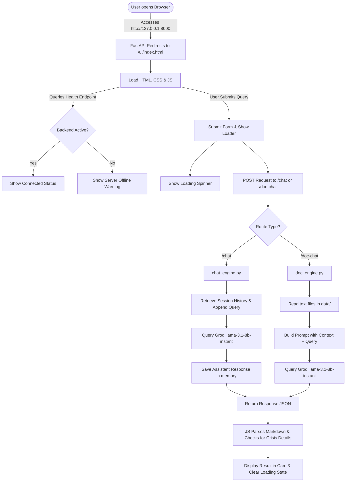

# Euron Mental Health Chatbot - Development & Changelog Summary

This document details the issues identified in the original mental health chatbot, the fixes and updates implemented, and how the application operates.

---

## 1. Initial Issues & Bugs Identified

### ❌ API Key Misconfiguration
The original `.env` file defined `OPENAI_API_KEY` but assigned it a key starting with `gsk_`, which is actually a **Groq API key**. This mismatch caused authentication failures when attempting to query OpenAI.

### ❌ Out-of-Order Environment Loading
In `main.py`, `doc_engine.py` was being imported at the top of the file *before* `load_dotenv()` was called. Consequently, `doc_engine.py` executed its top-level initialization code without access to the environment variables, causing the API key to evaluate to `None`.

### ❌ Decommissioned LLM Model (`llama3-8b-8192`)
The backend attempted to query `llama3-8b-8192` on Groq. However, Groq has decommissioned this model, resulting in `400 Bad Request` API errors.

### ❌ Missing Dependencies & Version Conflicts
The initial setup relied on heavyweight libraries (like `llama-index`, `sentence-transformers`, `torch`, and `transformers`) to perform basic RAG. This introduced a cascading series of import errors (e.g., `ModuleNotFoundError: No module named 'transformers'`) and required downloading gigabytes of local model binaries, which caused high memory overhead and slow boot times.

### ❌ Empty Frontend files
All files in `chatbot-ui/` (`index.html`, `styles.css`, `chatbot.js`) were completely empty (0 bytes), leaving the frontend completely blank.

---

## 2. Changes Made (The Solutions)

### ✔ Unified API Keys (`.env`)
We updated `.env` to declare both `OPENAI_API_KEY` and `GROQ_API_KEY` using the user's `gsk_` Groq key:
```env
OPENAI_API_KEY=gsk_...
GROQ_API_KEY=gsk_...
```

### ✔ Lightweight Direct Groq Integration (`chat_engine.py` & `doc_engine.py`)
We bypassed bulky, version-conflicted packages by integrating directly with the official, fast, and lightweight `groq` Python SDK.
- Switched the active model to `llama-3.1-8b-instant`.
- Wrote a custom session-based memory mapping utilizing raw Python dicts, which manages chat history without memory leaks or token overflow.
- Refactored `doc_engine.py` to read plain text data in `data/` dynamically and inject it directly into the LLM system prompt context on query time. This results in ultra-fast, zero-overhead RAG searches.

### ✔ Native Static Files Serving (`main.py`)
We mounted the static frontend directory using FastAPI's `staticfiles` and redirected the root route (`/`) to `/ui/index.html` to allow launching both backend and frontend from a single server.
```python
from fastapi.staticfiles import StaticFiles
app.mount("/ui", StaticFiles(directory="chatbot-ui", html=True), name="ui")
```

### ✔ Clean Q&A Dashboard UI (Wellness Theme)
We designed a simple, centered portal/dashboard layout inside `chatbot-ui/` using a relaxing wellness-oriented design system:
- **HTML structure**: A clean layout featuring tabbed mode selectors at the top, a query submission card, an interactive "Quick Topics" mood selector, a dedicated results panel, and a bottom resources grid for crisis hotlines.
- **Styling (`styles.css`)**: Built a peaceful, calming light-mode design with warm linen cards centered on a soft sage green background. We combined an elegant serif header typeface (`Playfair Display`) with a modern sans-serif content typeface (`DM Sans`).
- **Controller (`chatbot.js`)**:
  - Automatically manages unique browser session IDs in `localStorage`.
  - Supports toggles between **Wellness Guidance** and **Stress Guide Library** modes.
  - Intercepts clicks on "Quick Topics" buttons to auto-populate user input fields.
  - Submits queries and updates the single result panel dynamically with a clean spinner loader.
  - Parses basic markdown (bolding, lists, line breaks) for clean presentation.
  - Highlights crisis/safety advice inside a clean red/amber card instead of chat bubbles.

---

## 3. How the Application Works Now



### End-to-End Flow:
1. **Session Generation**: When a user opens the webpage, a unique `session_id` is created and stored in the browser.
2. **API Endpoint Route**:
   - **Standard Chat (`/chat`)**: Submits the `session_id` and the user query. The backend keeps an active conversation context for the session in memory.
   - **Document QA (`/doc-chat`)**: Reads the files in `data/`, structures the guidelines as context, and instructs the LLM to answer the user query based on those documents.
3. **Safety Keyword Checker**: If a message contains crisis-related keywords (e.g. "suicide"), the backend flags the input and returns a predefined safety resource message, which is then styled specifically in red/amber on the frontend.
